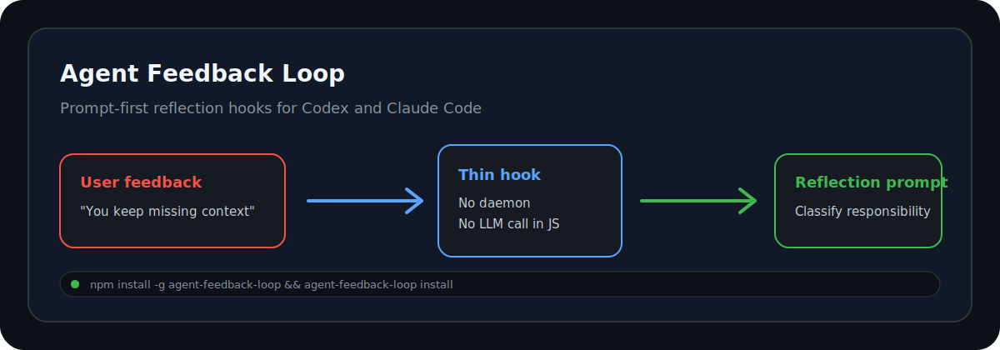
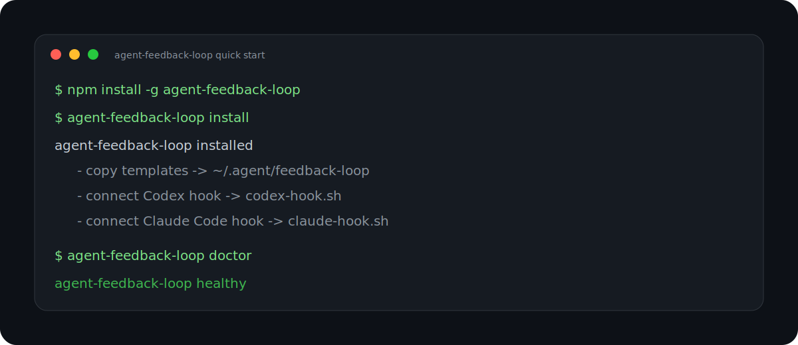
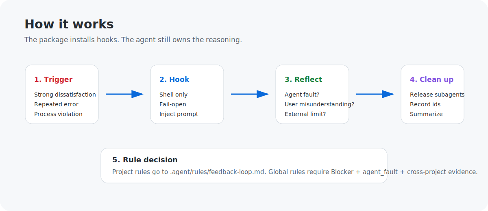

# Agent Feedback Loop

<p align="center">
  
</p>

<p align="center">
  <a href="https://www.npmjs.com/package/agent-feedback-loop"></a>
  <a href="https://www.npmjs.com/package/agent-feedback-loop"></a>
  <a href="#development"></a>
  <a href="LICENSE"></a>
</p>

```text
 █████╗  ███████╗ ██╗
██╔══██╗ ██╔════╝ ██║
███████║ █████╗   ██║
██╔══██║ ██╔══╝   ██║
██║  ██║ ██║      ███████╗
╚═╝  ╚═╝ ╚═╝      ╚══════╝
Agent Feedback Loop
```

> 中文版：见 [中文](#中文)

Prompt-first feedback reflection hooks for **Codex** and **Claude Code**.

Agent Feedback Loop makes an AI coding agent pause when the user says it repeatedly made mistakes, missed context, skipped required process, or caused strong dissatisfaction. It installs lightweight hooks that inject a reflection prompt before the agent continues.

The key design choice: **the reflection logic lives in Markdown, not in JavaScript or Python.**

## Important

`0.1.0` is the first public release:

- npm install works directly from the registry.
- Codex and Claude Code hooks are installed by one command.
- No background service is started.
- The package does not call an LLM from JavaScript.
- Project rules stay isolated in `.agent/rules/feedback-loop.md`.

## Why Agent Feedback Loop

AI coding agents are good at moving fast, but they can also repeat the same mistake: ignoring context, skipping a required test, claiming completion too early, or answering defensively when the user is clearly unhappy.

Most teams solve this by adding more rules to `AGENTS.md` or `CLAUDE.md`. That works for a while, then the file becomes a wall of warnings and every project inherits too much baggage.

Agent Feedback Loop separates the concern:

- **Hooks** detect strong feedback and inject a reflection prompt.
- **Markdown prompts** define the reflection process.
- **The agent** classifies responsibility and decides whether a rule is justified.
- **Project rules** stay in `.agent/rules/feedback-loop.md`.
- **Global rules** are reserved for repeated, generalizable, cross-project agent faults.

## What You'll Learn

This repository is intentionally small so it can serve as a reference for:

- How to distribute AI-agent workflow hooks through npm.
- How to keep prompt logic editable by non-programmers.
- How to support Codex and Claude Code without a daemon.
- How to fail open when hooks cannot run.
- How to require the agent to distinguish `agent_fault` from `user_misunderstanding`.
- How to make subagent cleanup part of the reflection contract.

## Install

Requirements:

- Node.js 18+
- npm/npx
- Codex and/or Claude Code if you want automatic hook integration

```bash
npm install -g agent-feedback-loop
agent-feedback-loop install
```

Without global install:

```bash
npx agent-feedback-loop install
```

## Quick Start

```bash
agent-feedback-loop install
agent-feedback-loop doctor
```

`agent-feedback-loop install` will:

1. Copy the prompt pack to `~/.agent/feedback-loop`.
2. Back up `~/.codex/config.toml` and `~/.claude/settings.json` if they exist.
3. Connect a Codex `UserPromptSubmit` hook.
4. Connect a Claude Code command hook.
5. Connect a Claude Code agent prompt hook.

## Screenshots

<p align="center">
  
</p>

Install and diagnose the prompt-first feedback loop in one minute.

<p align="center">
  
</p>

Strong feedback becomes an explicit reflection step instead of another warning buried in project instructions.

## Commands

`agent-feedback-loop install` — Install prompt pack and hook integrations.

```bash
agent-feedback-loop install
agent-feedback-loop install --dry-run
agent-feedback-loop install --home /tmp/test-home
```

`agent-feedback-loop doctor` — Check prompt files, hook files, and CLI config connections.

```bash
agent-feedback-loop doctor
agent-feedback-loop doctor --home /tmp/test-home
```

`agent-feedback-loop uninstall` — Remove hook integrations while preserving prompt files.

```bash
agent-feedback-loop uninstall
agent-feedback-loop uninstall --remove-files
```

`agent-feedback-loop paths` — Print resolved install paths.

```bash
agent-feedback-loop paths
```

## Installed Files

```text
~/.agent/feedback-loop/
  hooks/
    codex-hook.sh
    claude-hook.sh
  prompts/
    reflection-agent.md
  rules/
    feedback-loop.md
```

The installer patches:

```text
~/.codex/config.toml
~/.claude/settings.json
```

Backups are created before config changes:

```text
~/.codex/config.toml.backup-YYYYMMDDHHMMSS
~/.claude/settings.json.backup-YYYYMMDDHHMMSS
```

## Reflection Contract

When triggered, the prompt requires the agent to classify responsibility as exactly one:

- `agent_fault`
- `user_misunderstanding`
- `shared_ambiguity`
- `external_limit`
- `insufficient_evidence`

It also requires:

- evidence before rule changes;
- subagent close/release after reflection reports are consumed;
- `released_agent_ids` or an explicit CLI limitation note;
- project-specific rules in `.agent/rules/feedback-loop.md`;
- global promotion only for `Blocker + agent_fault + generalizable + cross-project evidence`.

## What It Does Not Do

- It does not start a background service.
- It does not call an LLM from JavaScript.
- It does not upload conversation content.
- It does not force every correction into a rule.
- It does not edit `AGENTS.md` or `CLAUDE.md` by default.

## Supported Platforms

| Platform | Status | Integration |
| --- | --- | --- |
| Codex | Supported | `UserPromptSubmit` command hook |
| Claude Code | Supported | command hook + agent prompt hook |
| Other CLIs | Manual | copy the Markdown prompt and wire your own hook |

## Project Rule Isolation

Project-specific feedback rules should live here:

```text
<project>/.agent/rules/feedback-loop.md
```

Keep `AGENTS.md` and `CLAUDE.md` small. They should point to project rules, not become a long incident log.

## Development

```bash
git clone https://github.com/super3ben/agent-feedback-loop.git
cd agent-feedback-loop
npm test
npm pack --dry-run
node ./bin/agent-feedback-loop.mjs install --home /tmp/afl-home
```

## 中文

Agent Feedback Loop 是一套面向 Codex 和 Claude Code 的“提示词优先”自动反思机制。

当用户表达强烈不满、指出重复错误、说 agent 漏上下文或没有按流程执行时，它会通过 CLI hook 注入反思提示，让 agent 在继续执行前先复盘。

核心原则：

- 不启动后台服务。
- 不用 JavaScript 调大模型。
- 不把反思逻辑写死在代码里。
- hook 只负责触发，Markdown prompt 负责流程。
- 非程序员也可以直接维护 `reflection-agent.md` 和 `feedback-loop.md`。
- 子 agent 分析完必须关闭/释放，并记录 `released_agent_ids` 或说明 CLI 不支持释放。
- 项目规则写到 `.agent/rules/feedback-loop.md`，避免 `AGENTS.md` / `CLAUDE.md` 无限膨胀。

### 安装

```bash
npm install -g agent-feedback-loop
agent-feedback-loop install
agent-feedback-loop doctor
```

### 常用命令

```bash
agent-feedback-loop install      # 安装并接入 Codex / Claude Code
agent-feedback-loop doctor       # 检查是否安装成功
agent-feedback-loop uninstall    # 移除 hook 配置，保留 prompt 文件
```

### 维护方式

通常只需要改这两个 Markdown 文件：

```text
~/.agent/feedback-loop/prompts/reflection-agent.md
~/.agent/feedback-loop/rules/feedback-loop.md
```

如果要调整触发词，再改：

```text
~/.agent/feedback-loop/hooks/codex-hook.sh
~/.agent/feedback-loop/hooks/claude-hook.sh
```

## License

MIT
